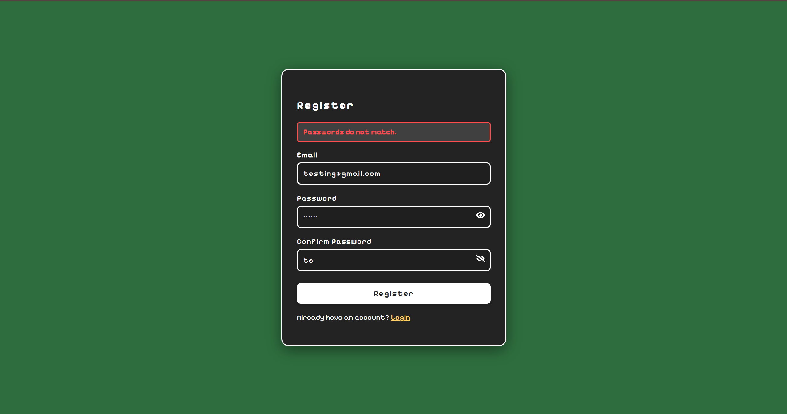
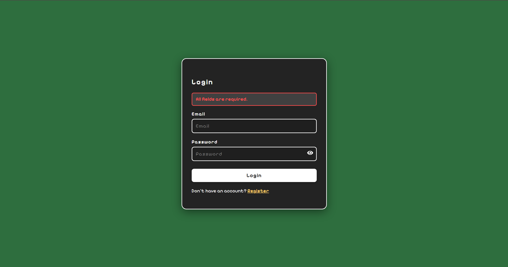
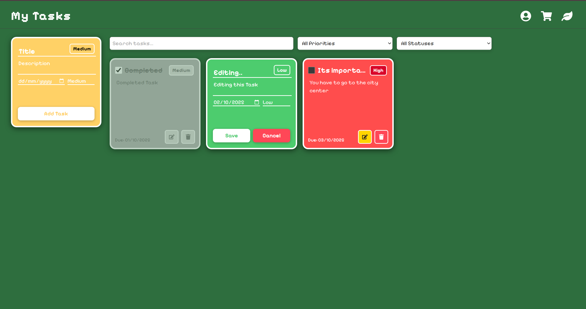
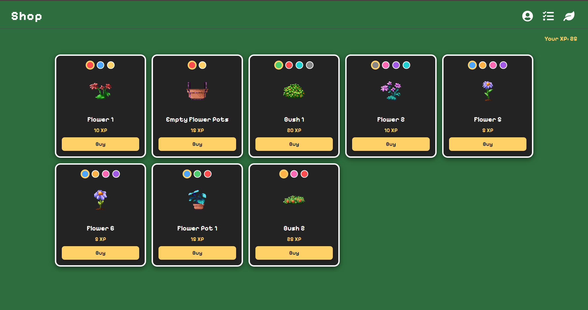
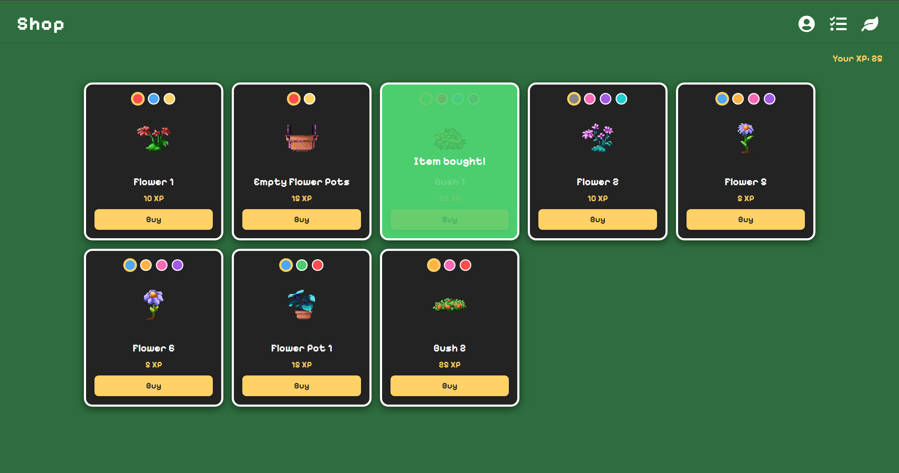
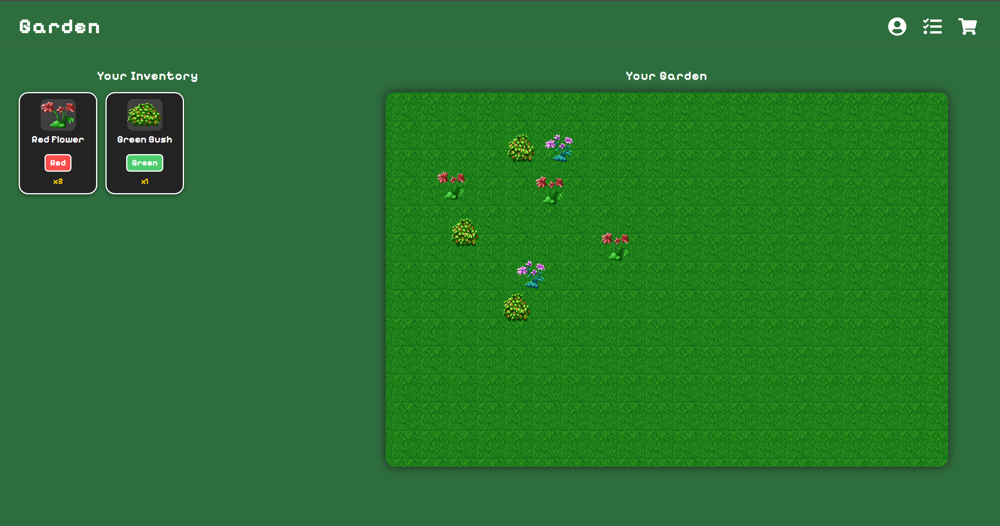
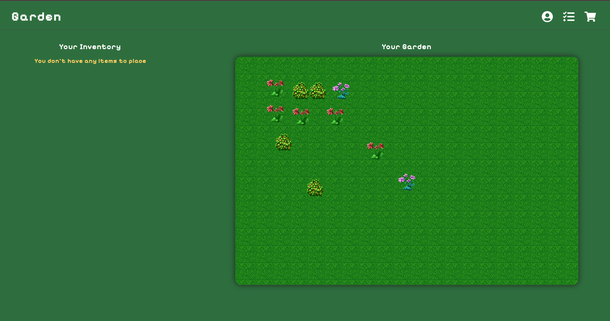
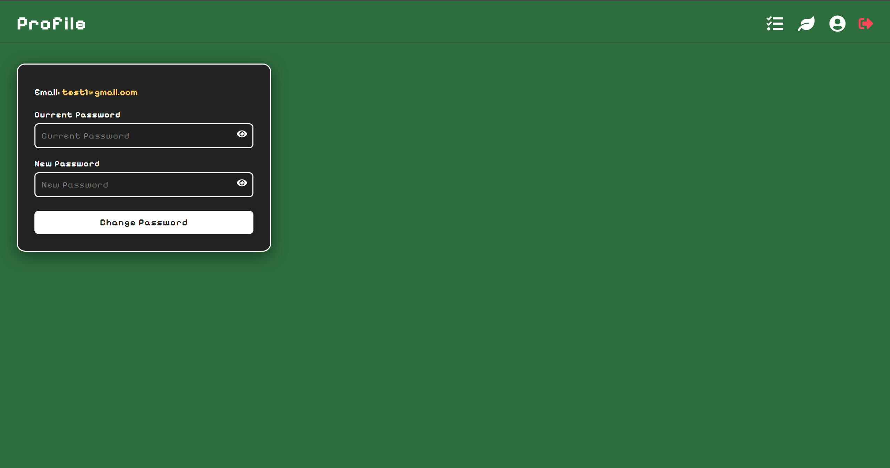

# GODO

**GODO** is a pixel-art inspired productivity and gamification web application. It combines a playful, retro visual style with practical tools to help users manage their daily tasks and goals in a fun and interactive way.

---

## Project Overview

GODO allows users to:

- **Create and manage tasks** to earn experience points (XP).
- **Spend XP in a pixel-art shop** to collect unique items with various color variants.
- **Organize and view their inventory** of collected items.
- **Design a personal garden** by dragging and dropping items from their inventory, with the ability to move and remove items freely.
- **Manage their profile** with secure authentication, password change, and logout features.

---

## Fullstack Architecture

- **Frontend:**  
  Built with **React** (JavaScript), the frontend delivers a responsive, pixel-art themed user interface. It features animated feedback, drag-and-drop mechanics, and a consistent retro design across all pages.

- **Backend:**  
  Powered by **.NET (C#)**, the backend handles authentication, user management, task and XP logic, inventory, shop, and garden data.  
  All data is managed securely and efficiently through RESTful API endpoints, with **MySQL** used for local data storage and fully integrated with the backend for persistent data management.
---

## Highlights

- **Pixel-art UI:** Consistent retro styling using custom fonts and color palettes.
- **Gamified productivity:** Completing tasks rewards XP, which can be spent on collectible items.
- **Interactive garden:** Users can visually arrange their items in a customizable garden space.
- **Secure authentication:** JWT-based login, registration, and profile management.
- **Separation of concerns:** Cleanly separated frontend and backend for maintainability and scalability.

---

## Screenshots

### Register Page

### Login Page

### Task Page

### Shop Page

### Garden Page

### Profile Page

---

## Credits

- Pixel art flower assets by [karsiori](https://karsiori.itch.io/free-pixel-art-flower-pack).
- Font: [PixelifySans](https://fonts.google.com/specimen/Pixelify+Sans)
- Icons: [FontAwesome React](https://react-icons.github.io/react-icons/)

---

_This project demonstrates how a modern fullstack application can blend productivity tools with playful, engaging design._
